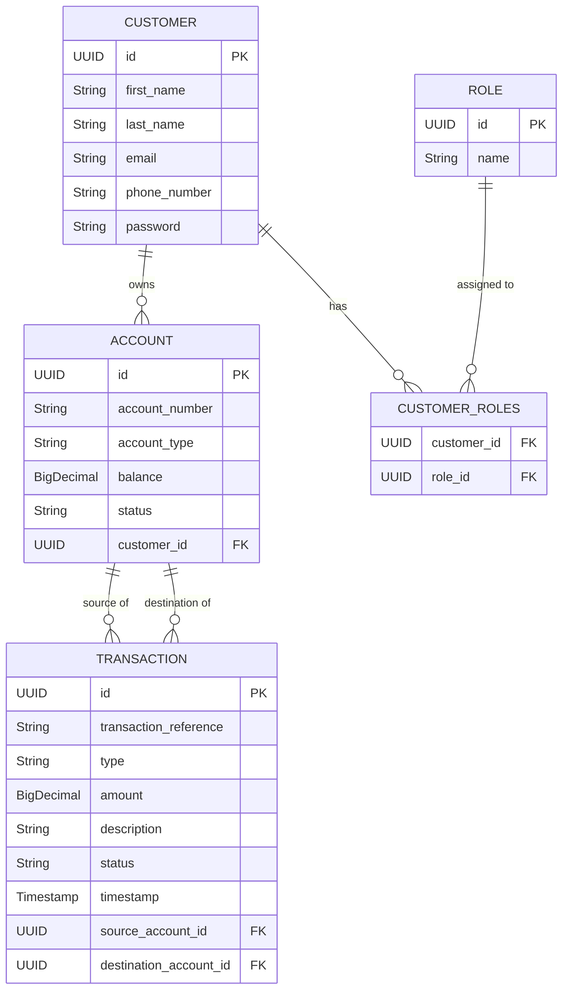

# BankLedger Enterprise Backend

BankLedger is a production-quality enterprise banking backend built with **Java 21** and **Spring Boot 3**. It is designed as a portfolio piece demonstrating clean architecture, strict security practices, and professional engineering standards.

## Project Overview

BankLedger implements core banking operations over a REST API. It handles user authentication, account creation, deposits, withdrawals, and secure peer-to-peer transfers.

The project strictly avoids over-engineering. It favors clean, understandable domain services over unnecessary abstractions like CQRS, Event Sourcing, or complex messaging queues.

## Tech Stack
- **Java 21** (Records, Virtual Threads compatibility)
- **Spring Boot 3.3.0** (Web, Data JPA, Security, Validation, Actuator)
- **PostgreSQL 15** (Relational Data persistence)
- **Flyway** (Database schema migrations)
- **JWT (jjwt)** (Stateless Authentication)
- **Swagger / OpenAPI 3** (API Documentation)
- **Docker & Docker Compose** (Containerization)
- **JUnit 5 & Mockito** (Testing)

---

## Architecture & Folder Structure
We follow a standard layered domain architecture.

```text
src/main/java/com/kushagragupta/bankledger/
├── config/         # Spring Security & Swagger configuration
├── controller/     # Thin REST controllers handling HTTP & DTO mappings
├── dto/            # Request & Response Data Transfer Objects
├── entity/         # JPA Domain models (Customer, Account, Transaction)
├── exception/      # Global Exception Handler and custom exceptions
├── repository/     # Spring Data JPA Interfaces
├── security/       # JWT Filters, UserDetails implementations
└── service/        # Core business logic and @Transactional boundaries
```

---

## Database Schema



---

## Local Setup (Maven)
1. Install JDK 21 and PostgreSQL 15.
2. Create a local Postgres database named `bankledger`.
3. Set environment variables:
   ```bash
   export SPRING_DATASOURCE_URL=jdbc:postgresql://localhost:5432/bankledger
   export SPRING_DATASOURCE_USERNAME=postgres
   export SPRING_DATASOURCE_PASSWORD=yourpassword
   export JWT_SECRET=your_base64_encoded_secret_at_least_256_bits
   export JWT_EXPIRATION=86400000
   ```
4. Run the application:
   ```bash
   ./mvnw spring-boot:run
   ```

## Docker Setup
You can spin up the entire application and PostgreSQL database with a single command:
```bash
docker compose up -d
```
The API will be available at `http://localhost:8080`.

---

## Deployment Instructions

### Backend (Render / Railway / Heroku)
1. Fork or push this repository to GitHub.
2. Create a new Web Service and link the repository.
3. Configure the Build Command: `./mvnw clean package -DskipTests`
4. Configure the Start Command: `java -jar target/bankledger-0.0.1-SNAPSHOT.jar`

### Database (Neon.tech)
1. Create a Serverless Postgres database on Neon.
2. Copy the connection string.

### Environment Variables
Configure these in your hosting provider's dashboard:
| Variable | Description | Example |
|----------|-------------|---------|
| `SPRING_DATASOURCE_URL` | JDBC connection string | `jdbc:postgresql://ep-....neon.tech/neondb` |
| `SPRING_DATASOURCE_USERNAME`| DB Username | `neondb_owner` |
| `SPRING_DATASOURCE_PASSWORD`| DB Password | `supersecret` |
| `JWT_SECRET` | 256-bit Base64 String | `404E635266556A586E32723575...` |
| `JWT_EXPIRATION` | Token expiry in MS | `86400000` (24 hrs) |

---

## API & Authentication Flow

1. **Register**: `POST /api/v1/auth/register` (Returns a JWT).
2. **Login**: `POST /api/v1/auth/login` (Returns a JWT).
3. **Authorize**: Add the header `Authorization: Bearer <your_jwt_token>` to all subsequent requests.
4. **Swagger UI**: Visit `http://localhost:8080/swagger-ui.html`. You can click the "Authorize" button and paste your token to test the API directly from the browser.

## API Examples

### Create Account
```http
POST /api/v1/accounts
Authorization: Bearer <token>
Content-Type: application/json

{
  "accountType": "CHECKING"
}
```

### Transfer Funds
```http
POST /api/v1/transfers
Authorization: Bearer <token>
Content-Type: application/json

{
  "sourceAccountId": "1111-2222-3333-4444",
  "destinationAccountId": "5555-6666-7777-8888",
  "amount": 500.00,
  "description": "Rent Payment"
}
```
